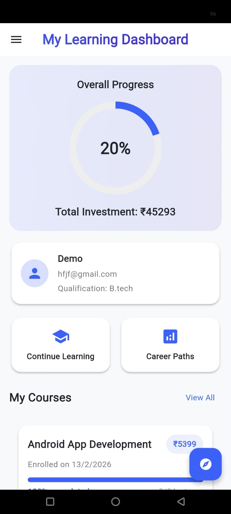
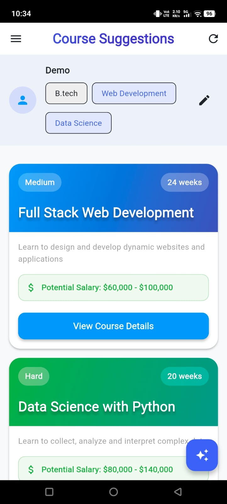
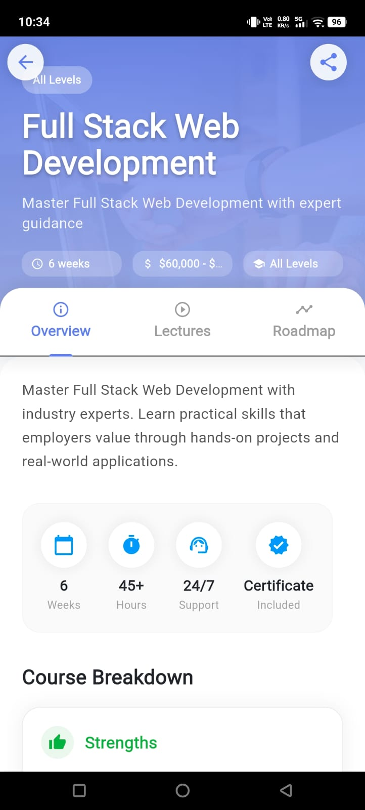
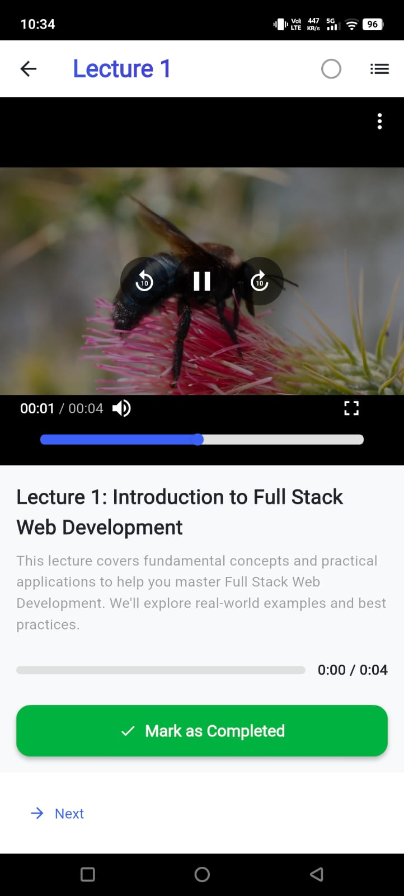
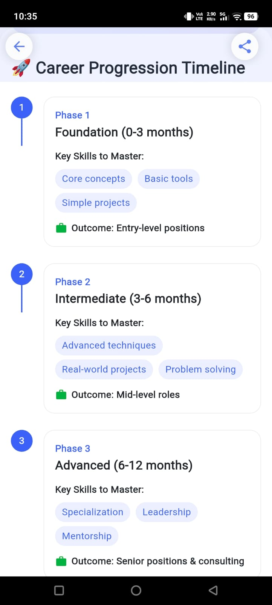

# 📚 Course Roadmap App (Flutter Based)

A smart and interactive **Course Recommendation & Career Guidance Application** built using **Flutter**. This app helps users discover the most suitable courses based on their qualifications and provides a complete roadmap including fees, learning resources, and career opportunities.

---

## 🚀 Features

### 🎯 Personalized Course Suggestions

* Users enter their **qualification details**
* The app uses **Grok API** to intelligently suggest:

  * Relevant courses
  * Course duration
  * Estimated fees
  * Course overview

### 🎥 Learning Resources

* Provides **video lectures and tutorials** related to the selected course
* Helps users start learning immediately

### 💼 Career Insights

* Detailed information about:

  * Job roles after completing the course
  * Career paths and growth opportunities
  * Industry demand and future scope

### 📊 Course Overview

* Complete breakdown of:

  * What the course covers
  * Skills you will gain
  * Required prerequisites

---

## 🛠️ Tech Stack

* **Frontend:** Flutter (Dart)
* **API Integration:** Grok API (for AI-based course recommendations)
* **UI Design:** Material UI / Custom Widgets
* **Video Integration:** Embedded video resources (YouTube or API-based)

---

## 📱 How It Works

1. User enters their **educational qualification**
2. App sends data to **Grok API**
3. API processes and returns:

   * Recommended courses
   * Fees and duration
   * Career insights
4. App displays:

   * Course details
   * Video lectures
   * Job opportunities and career guidance

---

## 📂 Project Structure

```
lib/
│── main.dart
│── screens/
│   ├── home_screen.dart
│   ├── result_screen.dart
│── services/
│   ├── api_service.dart
│── models/
│   ├── course_model.dart
│── widgets/
│   ├── course_card.dart
```

---

## ⚙️ Installation

1. Clone the repository:

```
git clone https://github.com/your-username/course-roadmap-app.git
```

2. Navigate to the project directory:

```
cd course-roadmap-app
```

3. Install dependencies:

```
flutter pub get
```

4. Run the app:

```
flutter run
```

---

## 🔑 API Configuration

* Get your **Grok API Key**
* Add it inside your API service file:

```dart
const String apiKey = "YOUR_API_KEY_HERE";
```

---

## 🌟 Future Enhancements

* User authentication (Login/Signup)
* Save favorite courses
* Advanced filtering (budget, duration, field)
* AI chatbot for career guidance
* Offline support

---

## 🤝 Contributing

Contributions are welcome!
Feel free to fork the repository and submit a pull request.

---

## 📸 App Screenshots

Here are some preview screens of the **Course Roadmap App**:

---

### 🏠 Home Screen

* User enters their qualification
* Clean and simple UI for input



---

### 🔍 Course Suggestions Screen

* Displays AI-generated course recommendations
* Includes course name, duration, and fees



---

### 📚 Course Details Screen

* Detailed overview of selected course
* Skills, syllabus, and prerequisites



---

### 🎥 Video Lectures Screen

* Embedded video lectures for learning
* Helps users start immediately



---

### 📊 Course Overview & Insights

* Future scope of the course
* Industry demand and career roadmap



---

## 💡 Conclusion

This app is designed to simplify career decision-making by combining **AI-powered recommendations** with **real-world insights**. It helps users not only choose a course but also understand the complete journey from learning to employment.

---
